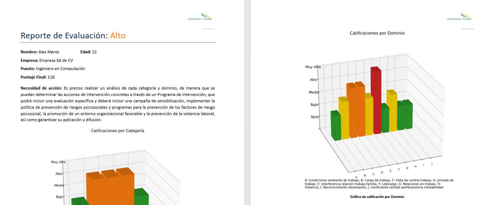
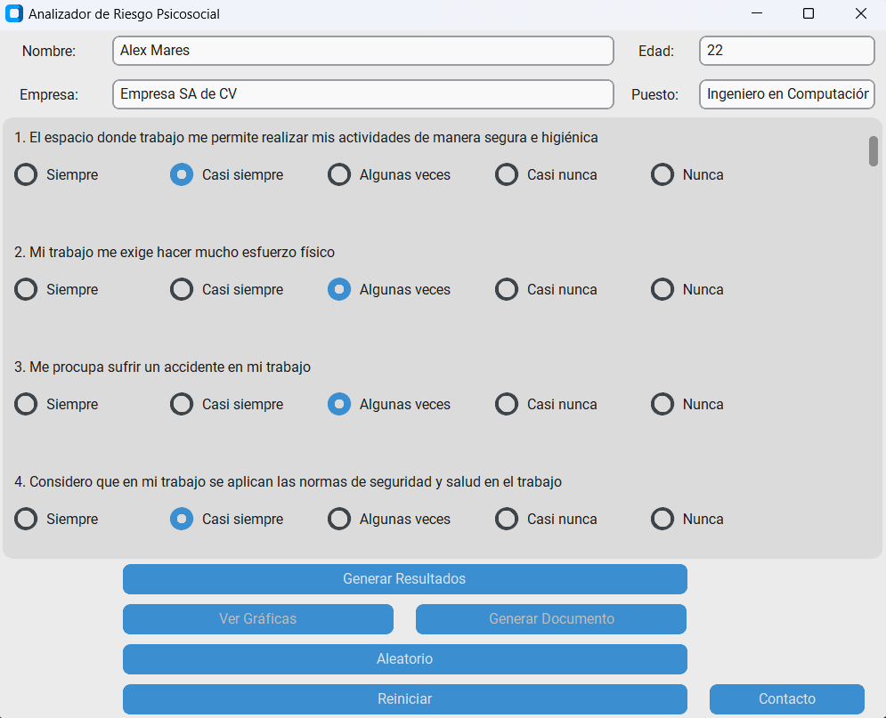
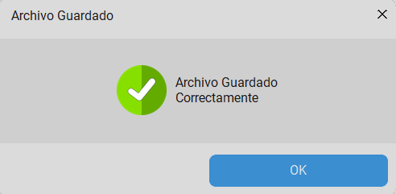

# **AutoRiesgoPsicosocial-NOM35**
Aplicación integral para la NOM-35. Automatización y Análisis del Riesgo Psicosocial en trabajadores. 
## Características
- Encuesta de la NOM-35 integrada
- Automatización de Análisis de riesgo psicosocial
- Generación automática de docuemntos WORD con resultados
- Personalización del documento con el logo de la empresa
- Fácil de usar con interfazintuitiva para usuario de todos los niveles
  

## Características del análisis:
- Calificación y puntaje por dominio
- Calificación y puntaje por categoría
- Calificación y puntaje total
- Necesidad de acción acorde a la calificación final
  

 
