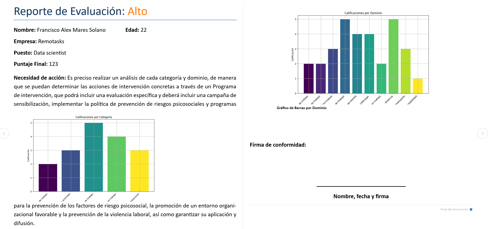

## 🛠️ Tools and Technologies Used

## 📊 Analysis Features

### 1. **NOM-35 Survey Integration**

- The application integrates the official NOM-35 survey, allowing users to complete it directly within the platform.

### 2. **Automated Psychosocial Risk Analysis**

- Automatically performs psychosocial risk analysis based on survey responses, evaluating risk across multiple domains and categories.

### 3. **Dashboard Creation**

- Generates interactive dashboards that visually represent the risk assessment results. These dashboards include scores by domain, category, and overall, making it easy to understand the findings at a glance.
- 

### 4. **Automatic PDF Generation**

- Automatically generates PDF reports with the analysis results, including all scores and assessments by domain, category, and total. The PDFs can be customized with the company logo for a professional look.

### 5. **User-Friendly Interface**

- The application features an intuitive graphical user interface (GUI) built with Tkinter, designed for users of all technical levels.

* * *

## 🚀 **Explore More Projects!**

### [📚 Check out all my projects on GitHub Pages](https://alxmares.github.io)

* * *
